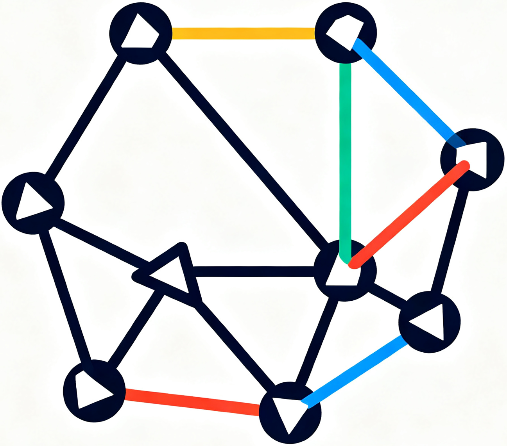

<div align="center">



# ***Hamilton Attention*** 

<a href="https://arxiv.org/abs/2509.26541">
    </a>
<a href="https://www.zhihu.com/people/hong_pku">
    </a>

😊 **Topology-aware Sequence Parallelism**
</div>

This is the official github repository of Hamilton Attention, also denoted as TASP (Topology-aware Sequence Parallelism).
Our implementation is based on pytorch distributed API and follows the design elaborated in our paper: [TASP: Topology-aware Sequence Parallelism](https://arxiv.org/abs/2509.26541). Please refer to this paper if you are interested in the mathematical and CS-related principals behind the code in this repository.

**TLDR**: Hamilton Attention is a novel distributed attention mechanism that leverages Hamiltonian decomposition to optimize communication efficiency over Ring Attention. This pytorch implementation provides efficient distributed attention computation with support for both causal and non-causal attention patterns.


## Installation

### Dependency

This implementation of Hamilton Attention is pytorch-based. It only requires pytorch and flash-attn ad its dependencies.

Luckily, for H100 and MI300X (platforms this implementation currently supports), pytorch and flash-attn can be easily installed via pip.

```shell
pip install pytorch
pip install flash-attn
```

For NVIDIA H100, the above pip installation would be suffice. For other NVIDIA GPUs (such as A100) it should work as well. 

For AMD MI300X, the simplest way is to utilize AMD official docker images. Please refer to AMD's documentation [Training a model with PyTorch on ROCm](https://rocm.docs.amd.com/en/latest/how-to/rocm-for-ai/training/benchmark-docker/pytorch-training.html?model=pyt_train_llama-4-scout-17b-16e) and follows its guidance. 

### Install

Since the Attention kernels we utilize (flash-attn) is pre-compiled, the installation of hamilton Attention only requires downloading the python scripts in this repository.

```shell
git clone https://github.com/infinigence/HamiltonAttention.git
```

## Quick Start

We provide the original test script with witch we evaluate the performance of Hamilton Attention over Ring Attention and Zig-zag Ring Attention in our paper.

- For fast reproduction of our results, we recommend you to refer to the [Test Script Usage](./docs/test%20script%20usage.md).
- For other usages, please refer to [Code Structure and API](./docs/code%20structure.md).

### File Structure
There are 4 sub-directories in this repository, each corresponding to an evaluation setting presents in our paper, documentation sub-directory (docs) is omitted:
```plaintext
.
├── H100-1
|   ├── hamilton_attention.py                 // Hamilton Attention implementation
|   └── test_hamilton_attention.py            // test script for H100-1
├── H100-2
|   ├── hamilton_attention.py                 // Hamilton Attention implementation
|   └── test_hamilton_attention.py            // test script for H100-2
├── H100-4
|   ├── hamilton_attention.py                 // Hamilton Attention implementation
|   └── test_hamilton_attention.py            // test script for H100-4
└── MI300X-1
    ├── hamilton_attention.py                 // Hamilton Attention implementation
    └── test_hamilton_attention.py            // test script for MI300X-1

```
## Citation 

```tex
@misc{wang2025tasptopologyawaresequenceparallelism,
      title={TASP: Topology-aware Sequence Parallelism}, 
      author={Yida Wang and Ke Hong and Xiuhong Li and Yuanchao Xu and Wenxun Wang and Guohao Dai and Yu Wang},
      year={2025},
      eprint={2509.26541},
      archivePrefix={arXiv},
      primaryClass={cs.LG},
      url={https://arxiv.org/abs/2509.26541}, 
}
```